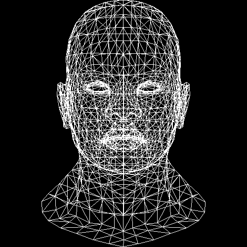
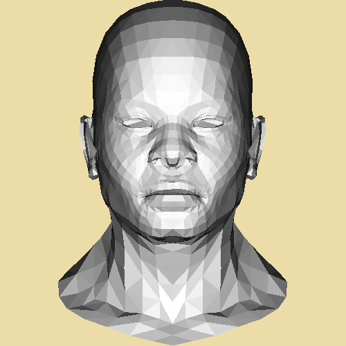
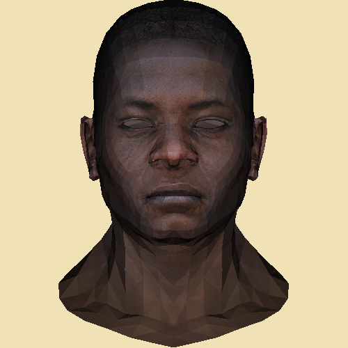

# NanoRender

Own version of TinyRenderer by **ssloy** --> [Link](https://github.com/ssloy/tinyrenderer)

Some parts of this projected were written using **ssloy**'s code as a guide.

Thank you to **PaulBourke** at [http://paulbourke.net/](http://paulbourke.net/) for the descriptions on how the **[TGA](http://paulbourke.net/dataformats/tga/)** and **[OBJ](http://paulbourke.net/dataformats/obj/)** file formats work.

Project's current state: **Got model rendering with triangles. Colours are based on how each triangle reflects colour**

Currently working on z-buffer tutorial
Wireframe rendering

Flat Shading Triangles (Thanks [@rajvirsamrai](https://github.com/rajvirsamrai) for the colour scheme suggestion)

Simple Intensity Shading

Textured Model with Intensity Shading

